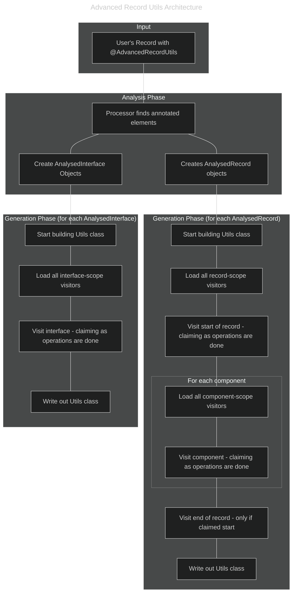

# Contribution guide

Thank you for taking the time to read the contribution guide! This guide will assume you are already somewhat familiar with the usage of the library.

# Contents

 * [Rules](#rules)
 * [Dependencies & Layout](#dependencies--layout)
 * [Architecture](#architecture)
 * [Style](#style)
 * [Contribution Examples](#contribution-examples)

If you want a slightly more "compact" version of this document, the `.coderabbit.yaml` file can be used to see what the AI reviewer is looking for. It's not perfect or 100% comprehensive (nothing is perfect) but it's another perspective on the codebase.

## Who is this guide for?

This guide is for anyone looking to contribute to Advanced Record Utils. We recommend at least skimming the whole document to understand the project's philosophy, but:
 * if you're fixing a small bug or typo, the [Rules](#rules) and [Style](#style) sections may be all you need.
 * if you're planning to add a new feature or support a new type, the [Rules](#rules), [Architecture](#architecture), [Contribution Examples](#contribution-examples) sections are essential. 

# Rules

Really, there are only two contributor rules:
 *  **Have fun, be kind, play together well** - the most important rule.
 *  **Contributions are final** - if you want any credits to you removed that's fine, but we won't remove code if you change your mind

## Interaction with existing contributions

This falls under the "play together well".

Where a potential contribution/setting has interactions with another contribution/setting, the second contribution should ensure proper interaction. The claim system is explained more below, but if someone for example overrides the core claim of `builderPlainSetter`, the onus is on them to ensure that all cross-interactions with that (including other overrides with other settings) work with the contributed version.

## Versioning

This falls under the "play together well", and the [README](README.md#versioning) covers this quite well:

 > With the same settings, changing the minor or patch version of the processor should be completely transparent to a consumer, even if the code the processor generates completely changes. A major version would only be needed if the end-user would be required to change their code...

For contributors, this means any changes in a `minor` or `patch` release must not break backward compatibility for a user.
 * The public API of generated code must not change.
 * The exact output of generated code (e.g., serialized XML) must remain identical.
   * An exception is made here - `minor` may be used for bug fixes or additional supported types

Breaking changes are reserved for major version updates. We should be able to take code built/written against `1.0.0` of the processor and swap the version to `1.30.2` and have the same inputs/outputs.

# Dependencies & Layout

The layout of the project is as so:
 * `advanced-record-utils-annotations` - this is the library that ends up on the user's module- or class-path
 * `aru-prisms-prison` - a library which is used to generate prisms (safe, reflection-free proxies to annotations that may or may not be on the classpath) in a way that means the processor doesn't depend on those libraries, and thus can safely detect if they exist in the final output without getting itself confused.
 * `aru-processor-core` - this implements the annotation processor itself, its analysis and interlinking of annotated types, the loading of the various features, and the "core" operations of the processor (a basic builder).
 * `advanced-record-utils-processor` - this implements all the features of the processor (such as Withers, Mergers, etc). It's deliberately isolated from the core processor itself - keep the complexity of feature implementation "walled off" from the complexity of analysis etc
 * `utils-tests` - all the tests! It isn't published, and is only for internal use.
 * `z_report_module` - this module isn't published either - it merges all the jacoco coverage reports into one report that can be used by e.g. CodeCov

The intent of the layout is that it should be easy to "plug-in" capabilities into the `advanced-record-utils-processor` - most contributions would be to this area. It's also the most "neat" - every class can mostly be self-isolated and easy to reason with. The `advanced-record-utils-processor`'s complexity should only end up being the number of classes it has, whereas the `aru-processor-core` is complex as it attempts to create a complete graph of operations and then enact it.

## The annotations library

The `advanced-record-utils-annotations` should not gain any required dependencies.

The `optional` dependencies that are applied to it are to indicate to consumers that, based on their settings for the generator, we can (potentially, maybe not yet) use/integrate with those dependencies. An example would be if they enabled validation for the `build` method of their builder - we would use the requested api to do that. The "sane" defaults for the annotation should require none of these (though detecting them and working with those is fine).

## The processor modules

Dependencies for the processor itself are a little different. Since those don't end up being included in final builds, we can afford to be a little more lenient there. However, keeping them low is ideal for a few reasons (mostly making it easier to detect when the end-user has them!), and really the processor doesn't need the dependencies in order to generate code that does.

Tests can can use dependencies that `utils-annotations` declares as optional in order to test functionality, or any that are useful for testing in general - that's completely fine!

# Architecture

## Contents

* [Architecture at a glance](#architecture-at-a-glance)
* [Architecture Overview](#architecture-overview)
* [`Claim`s](#claims)
* [`RecordVisistor`s](#recordvisistors)
* [`ToBeBuilt` (`GenerationArtifact` and family)](#tobebuilt-generationartifact-and-family)
* [Wrappers and common utils](#wrappers-and-common-utils)
* [Annotation Inferencing](#annotation-inferencing)
* [`CommonsConstants` and `Constants`](#commonsconstants-and-constants)

## Architecture at a glance

 * `RecordVisitor`: A component that "visits" a record and its fields to generate a piece of code.
 * `Claim`: Represents a specific unit of work (e.g., "create the builder's setter method for this field"). A `Claim` can only be successfully made once.
 * `Specificity`: A ranking system for `RecordVisitors`. More specific visitors (e.g., one that only handles `String` fields) run before more generic ones, getting the first chance to make a `Claim`.
 * `ToBeBuilt`: A wrapper around JavaPoet's `TypeSpec.Builder` that manages the construction of the final generated `*Utils` class and its inner components.



## Architecture Overview

This annotation processor utilises the Micronaut fork of the `JavaPoet` library. `JavaPoet`s original documentation from Square is pretty good, so please refer to that for information on `TypeSpec`, `ClassName`, etc.

You would already be familiar with the "public" inner elements of the resulting `Util` class. The Util class also generates items beginning with an `_` for internal usage.

Most contributions will work with `RecordVisitor`s and `Claim`s. A `RecordVisitor` has two key attributes:
 * The work it `Claim`s to perform
 * How "specific" it is at doing its work

The core actions of the `Processor` are to:
 * Find all annotated elements, as well as all referenced elements if applicable (imports, package imports, recursive elements) 
 * Build up the `ClassName` objects, settings, and builds the overarching `UtilsProcessingContext` and subcomponents (`AnalysedRecord`, `AnalysedInterface`, `AnalysedComponent`, and `ToBeBuilt` are the main ones)

Then for each loaded record that we need to provide a Utils class for, the `Processor`:
 * Uses avaje-inject to load all `RecordVisitor` instances, places builder items before non-builder items, and within those categories (builder, non-builder) sorts from the highest specificity to the lowest specificity
    * Doing the builder method firsts means you can check if a builder method exists before building something that uses it!
 * Each visitor is then told that the record is "starting" 
 * For each `RecordComponent`, each visitor is given each field
 * Each visitor is told the record is "ending" 

When a `RecordVisitor` "visits" the start or end of a record, or a component of the record, it is asked if it will `Claim` the work that it intends to do. If a `Claim` is made, all further visitors that make that same `Claim` are skipped. As visitors are used in order from most to least specific, this means that a visitor that handles a specific edge case or condition can `Claim` and perform the work and is preferred over a more generic or fall-back visitor. 

An example would be the `WriteString`, `WriteOffsetDateTime` and `WriteFallback` visitors: All three claim to perform the same operation (`XML_WRITE_FIELD`), but `WriteString` and `WriteOffsetDateTime` are more "specific" as they only process elements that are of `String` or `OffsetDateTime` respectively. The `WriteFallback` is less specific as it doesn't filter the types of elements it receives and processes all unclaimed elements (and thus it just `toStrings` them).

## `Claim`s

A `Claim` represents a unit of work that the processor aims to achieve. A unit of work can only be `Claim`ed once, and it will be either a class-level (as in, applies to the record or output class as a whole) or element-level (as in, applies to a specific record component) claim. 

Claims can be sorted into two groups:
 * Core
 * Non-core

Core claims are work that is integral to the Utils result. The only core elements are in the builder:
 * Fields
 * Getters
 * Plain Setters
 * Single-item adders for collections
   
All other operations are considered non-core claims. Non-core claims should decorate and/or delegate to core methods as much as possible. An example is the `build` method of the builder which delegates to calling getters when constructing a new instance. Non-core elements may also decorate or delegate to other non-core elements. These nested method calls may seem inefficient, but the JVM is exceptional at inlining and optimising frequent operations (and things like DB or HTTP calls are going to be much, much more time-intense anyway).

The intent of this is that:
 * adding functionality that changes the core of the utils (e.g. Adding `null` checks to setters on the builder) is automatically integrated with all other features; and
 * adding non-core functionality (almost) always not have to be concerned with other functions

Times in a which a non-core claim does *not* defer to a core claim should be limited. An example of an acceptable use is having an `addAll` method for collections that doesn't defer to the `add` method when:
 * The user has specified a collection type that we can be certain of at both `add` and `addAll` method creation time (e.g. Eclipse immutable collections - the `Builder` could hold a `Mutable` collection )
 * We can be certain that the field isn't null

## `RecordVisistor`s

A `RecordVisitor` represents a component of the processor that produces generated code. A `RecordVisitor` has:
 * A specificity - how specific it is at performing its operation (e.g. I check `5` things before determining if I proceed)
 * A `Claim` - which operation it aims to perform
 * A `Scope` that determines when/how it is loaded (e.g. a `RecordVisitor` that works on a per-component basis for XML utilities is in the `XmlPerComponentScope`)

A `RecordVisitor` should also have `RequiresBean` or `RequiresProperty` annotations to not be loaded in instances where they are not applicable.

The methods to visit the start of a record and to visit a component in that record return booleans. A `RecordVisitor` should make any checks it needs to for that specific item, and then return true if and only if it performs work for that element.

Repeated operations or helper operations can also be broken into an extension of the `RecordVisitor` class with child elements. A good example to check is the `SetToNow` visitor family - they are reasonably small, but they do a few checks and ultimately delegate to the core plain setter.

Specificity of items that generate the utils class structure generally work backwards from max int or forwards from min int. The reasoning is that this structure isn't intended to be overridden (as in, why override the `TypeSpec.Builder` for the `builder` class?).

## Wrappers and common utils

### `ToBeBuilt` (`GenerationArtifact` and family)

These are wrappers around the JavaPoet `TypeSpec` that makes navigating our nested `Utils` class structure easy, and integrates with the claim system to help ensure that only one instance of a given class/method is generated.

This also helps ensure that we can keep adding to the `TypeSpec` of generated classes and have it all be bundled up correctly at the end.

### `AnalysedRecord` (and family)

These are wrapper types around the `TypeElement` and the `AdvancedRecordUtils` annotation of a given item (which may be "inherited" from a referring class). This object should allow for access of everything needed to generate code for a given set of settings.

These can also be "cross-referenced" - that is, indicate that a generated `*Utils` class references another one. This is so that if a `*Utils` class is loaded from a library/another module, we can load an entire "graph" of classes. 

### `ComponentAnalyser` and `AnalysedComponent` (and family)

Similar to the `AnalysedRecord`, these are wrapper types around the `RecordComponentElement` and also have easy access back to the parent `AnalysedRecord`.

The `ComponentAnalyser` is a service loading target, similar to the `RecordVisitor` - it attempts to analyse from the most "specific" to the least specific. By doing this, we can make it easy to add new `AnalysedComponent` types (such as `Map`, or the Guava types).

## Annotation Inferencing

Annotation inferencing refers to the concept that we can *infer* or safely assume that an annotation should be present, even if it isn't. An example of this would be that the end-user has asked for their data structure to have XML serialisations added, but has only marked the structure up with Json annotations. We can take those annotations and infer the XML annotations from those.

## `CommonsConstants` and `Constants`

There are two constants files that contain things that will come up repeatedly - things like `Claim` objects and `ClassName`s. I'm aware "Constant" files are a bit controversial, but I think in this context I think it's a better way of ensuring that `Claim` operations don't "drift" and that we only go through the process of setting up the `ClassName`s once.

# Style

Generated code must:
 * Be readable
 * Be commented (e.g. JavaDoc, code comments)
 * Not generate `var` - use the proper type name

For processor code, the following broad rules apply:
 * If you are editing a file, keep the style consistent within the file
 * `Nullable` annotations should be used where needed (the codebase is/should be `NullMarked`)
   * `Optional` is preferred, and should never be nullable
 * No hard limits on the character length of a line - while code should fit on a screen, which screen? Easier to just gut feel it generally
   * Don't just wrap at an arbitrary point - if you need to wrap, make it consistent how the wrapping is applied
 * Fluent operators should go "down" the page - as if you are reading a series of steps in a recipe
 * Nesting lots of ifs/loops/etc is sometimes OK, but do consider if it should be a method call instead
 * Long methods can also generally be broken into smaller methods
 * JavaDoc can be helpful, and so can comments, so long as they don't re-describe the code
 * Generated code always takes priority for readability over the processor itself
   * It may be useful to think: "It's 2am, I've had 2 hours sleep, and there is a bug in prod which is why I'm reading the generated code"...
   * Complex branching logic could also be refactored into a different `RecordVisitor` or a helper
 * A gentle preference for for-loops over streams, but emphasis is on *gentle* (i.e. don't make your life hard for it)
 * A gentle preference for `final` modifiers to be used when possible
 * A gentle preference to avoid `var`

While this may cause issues because there isn't a concrete "style guide", it should avoid most issues. The project will not enforce a strict auto-formatting tool, preferring developer judgment to maintain consistency within a file. We recognize this is a trade-off, but the primary focus is on the readability of the generated code. For this reason, contributions are expected to be thoughtfully formatted by hand.

## Wrapping examples

```java
private static void analyseRecordComponentElement(final Map<TypeElement, ProcessingTarget> analysed, 
                                                  final AnalysedRecord analysisTarget, 
                                                  final Set<Name> intendedParams, 
                                                  final Set<ExecutableElement> ignoredExecutableElements,            
                                                  final RecordComponentElement componentElement
) {
    // Body here
}
```

```java
private static void analyseRecordComponentElement(
    final Map<TypeElement, ProcessingTarget> analysed, 
    final AnalysedRecord analysisTarget, 
    final Set<Name> intendedParams, 
    final Set<ExecutableElement> ignoredExecutableElements,            
    final RecordComponentElement componentElement
) {
    // Body here
}
```

```java
if(analysedComponent.isIntendedConstructorParam()) {
    final String name = analysedComponent.name();
    final MethodSpec.Builder method = analysedComponent.builderArtifact()
        .createMethod(name, claimableOperation, analysedComponent.element())
        .returns(analysedComponent.typeName())
        .addAnnotation(NULLABLE)
        .addModifiers(Modifier.PUBLIC)
        .addJavadoc("Returns the current value of {@code $L}\n", name)
        .addStatement("return this.$L", name);
    
    AnnotationSupplier.addGeneratedAnnotation(method, this);
    return true;
}
```

# Contribution Examples

These are examples of contributions that could be made to the project. The language *should*, *may*, and *should not* are intended to be non-definitive - though I would prefer it to be done the way listed, it's not the only way, and you may have better ideas. They are more intended to walk you through the thinking that goes into working with the `Claim` and `RecordVisitor` system.

## Issue: Add Staged Builders

Barret wishes to add "Staged Builders" - an idea in which you can only set fields in order.

To implement this, Barret should:
 * Add a `StagedBuilder` class-level claim to wrap all generated classes and a visitor that creates that
 * Add a `XyzStageBuilder` class for each stage in the build process inside the `StagedBuilder` class (so full path is `MyRecordUtils.StagedBuilder.XyzStageBuilder`) and a visitor that creates them
 * Each stage should be a wrapper around the existing `Builder` class - that is, they delegate the actual work to the `Builder` class, and only return the appropriate wrapper.
    * This is to ensure that, as the builder expands in capability, the `StagedBuilder` automatically "inherits" those capabilities

Barret may:
 * Make generation of the staged builders behind an option in the annotation

Barret may need to consider how to work with `add` methods - they should delegate, but probably not "terminate" the current stage. Barret may choose to have a `next` method for collection types.

Barret may also add an option to the annotation that determines if the Staged builder is the default/only externally accessible builder

Barret should avoid:
 * Managing an internal build state beyond the current "Stage" (done via class) and the internal `Builder`. The operations should delegate to the `Builder` instead
 * Overwriting the `builder` method on the root `Utils` class by default. A toggle should be implemented instead
 * Completely replace the `Builder` even if the settings say it's not externally accessible

## Issue: Only permit single setting of fields

Tifa wishes to prevent "setter" methods from being called more than once.

To implement this, Tifa should:
 * Add an option to the annotation to opt in to validating that setter methods are only called once
 * Have a new visitor claim the `builderPlainSetter`, and create a setter that also tracks if a setter has already been called, and throw/act appropriately if called again
 * Have a new visitor claim `builderCopy` "reset" the tracker state (since it calls the setter fields as it goes)
    * This should also include checking that `Wither` and `Merger` works
 * Ensure that claims that alter collections (like `add`) work correctly

Tifa could do this by creating a `SetOnceBuilder` class that wraps the original builder and delegates calls to it after validating that the `set` call should go through 

## Issue: Add Guava support

Rufus wishes to add support for Guava collections.

To implement this, Rufus should:
 * Add a more specific version of the `builderGetter` claim that returns a relevant Guava collection
 * Add more `ComponentAnalyser` providers that can detect desired Guava types

Rufus may:
 * Add more specific versions of the claims `builderPlainSetter`, `builderField` and `builderAdd` to use Guava's builders
 * Add more specific versions of the claim `builderAddAll` that work with the items from the previous point

If Tifa's work has been added, and Rufus adds an override to the `builderPlainSetter`, then he should:
 * Ensure that there is a visitor claiming `builderPlainSetter` that works appropriately if both single-set and guava are enabled

Rufus should avoid:
 * Overriding the `builderAddAll` claim unless also overriding the `builderAdd` claim

## Issue: Add another serialiser

Aerith wishes to add support for another serialisation option e.g. `avaje-jsonb`.

To implement this, Aerith should:
 * Add relevant claims to create the hooks into `avaje-jsonb`
 * Use the builder when de-serialising

Aerith may:
 * Use extensions beyond the core claims when e.g. adding all items of a collection
 * Permit the use of e.g. XML annotations to dictate the generated json

Aerith should avoid:
 * Making an interface that is required to be implemented on all items in a deeply-nested structure